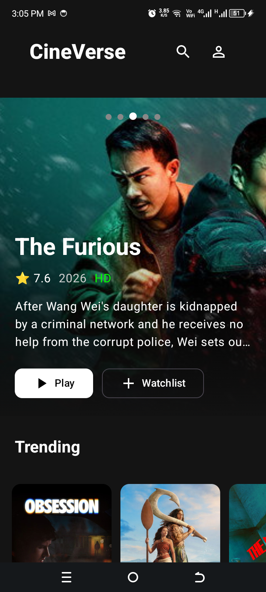
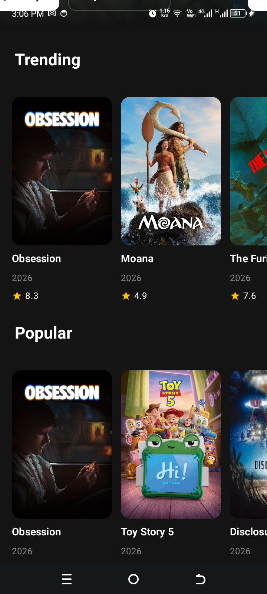
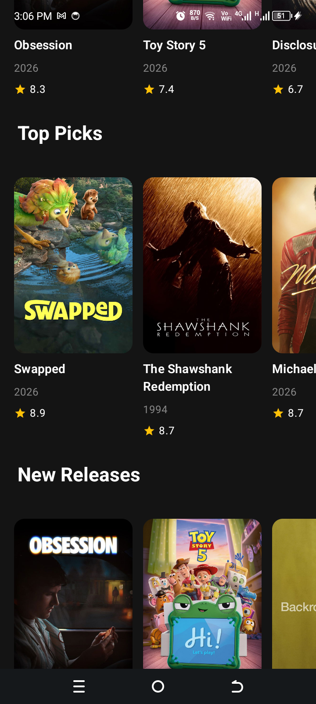
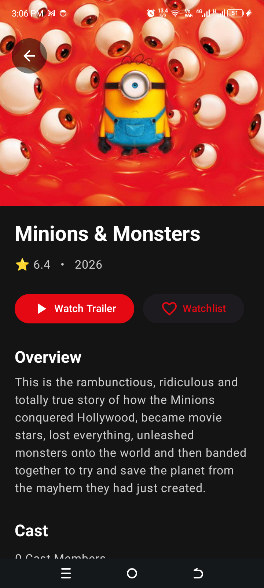

# 🎬 CineVerse KMP

A modern Netflix-inspired movie application built with **Kotlin Multiplatform (KMP)** and **Compose Multiplatform**, sharing business logic and UI across Android and iOS.

> Powered by The Movie Database (TMDB) API.

---

## 📱 Screenshots

| Featured | Popular | New Releases | Movie Details |
| :---: | :---: | :---: | :---: |
|  |  |  |  |

> Add your screenshots inside a `screenshots` folder.

```
screenshots/
├── featured.png
├── popular.png
├── new_releases.png
└── details.png
```

---

# ✨ Features

- 🎬 Trending Movies
- ⭐ Popular Movies
- 🏆 Top Rated Movies
- 🎥 Upcoming Movies
- 🔍 Movie Search
- 🎞 Netflix-style Hero Carousel
- 📄 Movie Details
- 👥 Movie Cast
- ⭐ Movie Reviews
- ▶ Movie Trailers
- 🌙 Dark Theme
- 🚀 Shared Business Logic
- 📱 Android & iOS Support

---

# 🏗 Architecture

The project follows **Clean Architecture + MVVM**.

```
Presentation
      │
      ▼
ViewModel
      │
      ▼
UseCases
      │
      ▼
Repository
      │
      ▼
Remote API (Ktor)
```

---

# 📂 Project Structure

```
androidApp/
iosApp/
shared/
│
├── core
│   ├── common
│   ├── extensions
│   ├── network
│   └── platform
│
├── data
│   ├── mapper
│   ├── remote
│   │   ├── api
│   │   ├── dto
│   │   └── repository
│
├── domain
│   ├── model
│   ├── repository
│   └── usecase
│
├── di
│
└── presentation
    ├── components
    ├── details
    ├── home
    ├── navigation
    └── theme
```

---

# 🛠 Tech Stack

- Kotlin Multiplatform
- Compose Multiplatform
- Kotlin Coroutines
- StateFlow
- Ktor Client
- Kotlinx Serialization
- Koin
- Compose Navigation
- Coil 3
- Material 3
- MVVM
- Clean Architecture

---

# 📡 API

Movie data is provided by:

**The Movie Database (TMDB)**

https://developer.themoviedb.org/

---

# 🚀 Getting Started

## Clone

```bash
git clone https://github.com/zulfiqarchandio88/CineVerse-KMP.git
```

---

## Android

Open with Android Studio.

Run:

```
androidApp
```

---

## iOS

Open:

```
iosApp.xcodeproj
```

Run on an iPhone simulator using Xcode.

---

# 🔑 API Key

Create a `NetworkConstants.kt` file and add your TMDB API key.

```kotlin
object NetworkConstants {

    const val API_KEY = "YOUR_API_KEY"

    const val BASE_URL = "https://api.themoviedb.org/3/"
}
```

---

# Implemented Screens

- Home
- Featured Carousel
- Movie Details

---

# Upcoming Features

- ✅ Favorites
- ✅ Offline Cache
- ✅ Search Screen
- ✅ Genres
- ✅ Similar Movies
- ✅ Watchlist
- ✅ Trailer Player
- ✅ Pagination
- ✅ Settings

---

# Demo


---

# Author

**Zulfiqar Chandio**

Senior Android & Kotlin Multiplatform Developer

LinkedIn

https://www.linkedin.com/in/zulfiqarchandio/

GitHub

https://github.com/zulfiqarchandio88

---

# License

MIT License

---

## ⭐ If you like this project, don't forget to star the repository!
